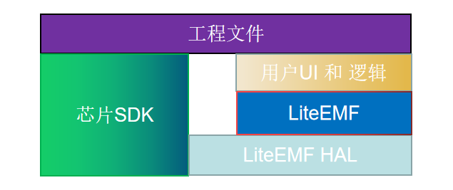
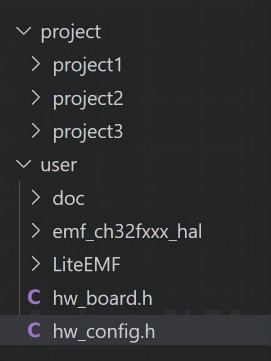

# <a id="top">LiteEMF 用户手册</a>

- [LiteEMF 用户手册](#liteemf-用户手册)
	- [**框架**](#框架)
		- [**描述**](#描述)
		- [**LiteEMF移植说明**](#liteemf移植说明)
	- [**app**](#app)
		- [**app\_key**](#app_key)
		- [**app\_led**](#app_led)
		- [**app\_km**](#app_km)
		- [**app\_joystick**](#app_joystick)
		- [**app\_rumble**](#app_rumble)
		- [**app\_battery**](#app_battery)
		- [**app\_adb**](#app_adb)
		- [**app\_imu**](#app_imu)
		- [**nanopb(protobuf)**](#nanopbprotobuf)
		- [**emf**](#emf)
	- [**utils**](#utils)
		- [**fifo**](#fifo)
		- [**list**](#list)
		- [**mem**](#mem)
		- [**filter**](#filter)
		- [**emf\_utils**](#emf_utils)
	- [**api**](#api)
		- [**api\_gpio**](#api_gpio)
		- [**api\_adc**](#api_adc)
		- [**api\_iic\_host**](#api_iic_host)
		- [**api\_spi\_host**](#api_spi_host)
		- [**api\_pwm**](#api_pwm)
		- [**uart**](#uart)
		- [**api\_wdt**](#api_wdt)
		- [**api\_tick**](#api_tick)
		- [**api\_system**](#api_system)
		- [**api\_timer**](#api_timer)
		- [**api\_soft\_timer**](#api_soft_timer)
		- [**api\_log**](#api_log)
		- [**api\_flash**](#api_flash)
		- [**api\_storage**](#api_storage)
		- [**api\_pm**](#api_pm)
		- [**api\_transport**](#api_transport)
		- [**api\_commander**](#api_commander)
		- [**api\_bt**](#api_bt)
		- [**api\_usb**](#api_usb)
	- [**hal**](#hal)
		- [**typedef**](#typedef)

## **框架**

LiteEMF 和 芯片sdk 通过 HAL虚拟硬件层连接,  HAL虚拟硬件层适配好sdk全部接口.  用户在LiteEMF(api和app层)上做用户UI和逻辑开发.最上层为工程文件, 用于切换不同工程项目.  
LiteEMF相当于一个模块植入到用户SDK中, 让后用户可以吧上层通用逻辑和用户的SDK隔离开来.




* 推荐的项目管理方式  
我们通常需要在同一个芯片平台上开发很多项目, 为了好管理这些项目我们推荐使用hw_confg.h,hw_board.h 来管理项目  

* project 用于保存项目相关的文件
* user 中有LiteEMF框架和HAL层
* hw_confg.h 用于编译选择项目和项目相关配置
```c
#define PROJECT1                  	0
#define PROJECT2               		1
#define PROJECT3	                0

#if PROJECT1
	/**********************************************************************************/
	#define DEV_TRPS_DEFAULT			BIT(TR_NULL)				/*产品传输层支持*/
	#define DEV_TYPES_DEFAULT			BIT(DEV_TYPE_NONE)
	#define HID_TYPES_DEFAULT			BIT(HID_TYPE_NONE)
	/**********************************************************************************/
	#define APP_KEY_ENABLE			1
	#define APP_JOYSTICK_ENABLE		1
	#define APP_RUMBLE_ENABLE		1
	#define APP_RGB_ENABLE			1
	#define APP_RGB_NUMS 			3

	#define SW_VERSION                     	0x01
	#define DEFAULT_NAME			       	"project1"
	#define DEFAULT_MODEL					"GP_dev"
#else if PROJECT2
...
...
```
* hw_board.h 用于编译选择对应项目的硬件io和资源

项目文件夹:  

### **描述**
LiteEMF 的设备驱动是在芯片上电后同一个函数统一初始化的.


### **LiteEMF移植说明**
[回到顶部](#top)
## **app**

LiteEMF 应用层, 脱离硬件的功能模块在这里实现

### **app_key**
按键模块实现了按键扫描功能. 嵌入式项目中经常使用到按键的长按, 短按, 双击, 组合按键等功能. 按键作为一个输入模块最佳的方式是收集按键输入事件(长短按等),在应用中使用这些消息.

void app_key_decode_task(uint32_t key_scan) 函数用来解析按键后输出到app_key_t中,用户应用通过这些按键事件来解析处理这些按键事件

```c
typedef struct{
	uint32_t pressed;
	uint32_t press_short;
	uint32_t pressed_b;
	uint32_t press_long;
	uint32_t long_long;
	uint32_t double_b;	
	uint32_t pre_double_b;
}app_key_t;
```

用户可以重定义 __WEAK void app_key_event(void) 函数,在该函数中处理按键消息,也可以在任意地方使用按键app_key_t 全局变量


### **app_led**
led模块用于单色led实现简单的常亮,闪烁功能.   
led做为一个输出模块使用的时候需要遵循如下原则
1. 如果产品单个led的功能有复用(比如模式指示和电源指示公用一个灯效)情况下, 产品尽量在同一个函数中通过各个模块状态实现led灯的控制. 
2. 如果产品每一个led的功能单一,可以考虑在对应模块的事件中控制led灯


### **app_km**

### **app_joystick**
摇杆校准和数据处理
### **app_rumble**
震动控制, 为了更好的控制震动功能,将震动数据缓存到rumble_ctb中,然后统一在 `void app_rumble_task(uint32_t dt_ms)` 函数中输出震动数据.
用户可以通过 `void app_rumble_set_duty(uint8_t id,uint8_t duty,uint32_t timeout_ms)` 函数填充震动数据
### **app_battery**
电池模块,实现了电池状态判断,电池电量计算. 输出电池电量百分百m_battery,和电池状态m_battery_sta.

`__WEAK bat_state_t app_battery_sta(bool power_on,uint16_t bat_vol)` 函数用于用户可以自定义判断电池状态

### **app_adb**
android adb 功能,目前功能暂时为完整实现
### **app_imu**
惯性测量单元(Inertial Measurement Unit) 这里统一了三轴sensor的接口. 规范了体感方向,实现滤波和校准功能

### **nanopb(protobuf)**
移植nanopb(goolge protobuf) 嵌入式c语言实现.详细使用方式参考[README文档](app/nanopb/README.md)

### **emf**
LiteEMF 功能模块汇总, 用户可以参考或者直接调用使用

[回到顶部](#top)
## **utils**
包含了常用的工具类相关函数

### **fifo**
先进先出队列, 参考nordic sdk fifo.c.
### **list**
列表头文件, 参考linux列,在单片机上可以实现列表功能. 使用方式可以参考list_test.c
### **mem**
 
 emf_mem.c 参考freeots 底层实现了4套heap管理方式, 通过HEAP_ID选择.用户可以根据自己的需要选择合适的内存管理机制

* 内存管理分类:
1. heap_1 —— 最简单，不允许释放内存。
2. heap_2—— 允许释放内存，但不会合并相邻的空闲块。
3. heap_4 —— 合并相邻的空闲块以避免碎片化。 包含绝对地址放置选项。
4. heap_5 —— 如同 heap_4，能够跨越多个不相邻内存区域的堆。

* 注意事项:  
嵌入式内存资源有限, 为了避免内存碎片化在使用emf_malloc的时候请遵循使用只分配临时内存的原则.即不要申请常驻不释放的内存.  
一种情况除非外,在系统初始化还没有申请过内存的时候,可以申请常驻内存不会导致内存碎布片.   

* 关于emf_mem_init  

有的平台在使用malloc之前需要进行初始化, 例如51单片机.  
emf_mem_stats 函数可以看到内存的使用情况,不同heap方式能获取到的信息会有差异  


### **filter**
滤波处理文件,用于通用的滤波处理. 打包了向量接口可以很方便的在项目中使用
* 一阶低通滤波
`void lpf_1st(float* outp, float measure, float lpf_factor)`  
lpf_factor: 输入截至频率,可以通过LPF_1ST_FACTOR 计算截止至频率 
outp: 需要传入上一次的输出值用于计算
* 卡尔曼滤波
卡尔曼滤波需要初始化Q,R参数

* FIR滤波(可以做窗口滤波)
FIR滤波可以初始化FIR滤波系数imp, 如果可没有传入imp系数相当于是一个窗口滤波器  
为了节省空间需要定义FIR最大窗口数量FIR_FILTER_MAX_LENGTH


### **emf_utils**
其他工具类函数接口

[回到顶部](#top)
## **api**
api 接口层负责提供硬件相关的接口,这里统一不同硬件的接口,起到承上启下的作用.

### **api_gpio**

### **api_adc**
adc模块api接口

用户通过 HW_ADC_MAP 定义adc io和外设, 在hal层 适配 `hal_adc_value` 读取adc值  

也可以通过 `hal_adc_start_scan` 接口适配中断adc 的dma采样,采样到的数据通过 `hal_adc_value` 返回上层


### **api_iic_host**
iic主机模块api接口

IIC_SOFT_ENABLE 可以配置使用软件IO口模拟iic还是使用 hal_iic_host 适配hal层来实现iic驱动

### **api_spi_host**
spi主机模块api接口

SPI_SOFT_ENABLE 可以配置使用软件IO口模拟iic还是使用 hal_spi_host 适配hal层来实现spi驱动
### **api_pwm**
pwm模块api接口

用户需要适配hal_pwm, 通过HW_PWM_MAP定义pwm的IO 和相关参数. 注意HW_PWM_MAP的定义值在不同硬件SDK上有区别 
### **uart**
uart模块api接口

用户需要适配hal_uart, 通过HW_UART_MAP定义uart的IO和相关参数. 注意HW_PWM_MAP的定义值在不同硬件SDK上有区别 

用户可以设置 `UARTn_PA` 来设置不同uart参数
```c 
typedef struct{
	uint32_t baudrate;
	uint16_t tx_buf_len;
	uint16_t rx_buf_len;
}uart_pa_t;
```


* uart 接收数据  
uart 使用fifo 做缓存方便应用层数据处理,应用层通过`api_uart_get_rx_fifo`获取uart rx fifo  
`__WEAK bool api_uart_rx_hook(uint8_t id,uint8_t* buf,uint16_t len)` 函数用于用户uart中断接收数据到fifo,用户需要在hal_uart层uart中断函数中调用该函数

* uart 发送数据  
可以串口发送可以直接发送或者通过fifo发送. 只能选一,具体选择哪一种根据根据用户需求来确定
`uart调用 bool api_uart_tx(uint8_t id,void * buf,uint16_t len)` 串口发送函数直接发送, 函数被调用后直接吧数据发出去,调用函数时候会占用发送时间.  
`bool api_uart_fifo_tx(uint8_t id,void * buf,uint16_t len)` 通过txfifo发送, 调用函数的时候数据没有被真正发送,在任务`void api_uart_tx_task(void* pa)`中才被发送.fifo tx通常用于打印debug 调试log.  
### **api_wdt**

### **api_tick**
系统嘀嗒时钟和延时函数api接口, api_tick 是很重要的一个接口,系统所有和时间相关的功能都需要使用到.  

用户需要设置两个全局tick, 可以是全部变量或者是根据sdk通过宏定义实现  
`m_systick`	以1ms为单位的tick时钟, 该时钟和任务是异步的  
`m_task_tick10us` 以10us为单位的tikc时钟, 该时钟需要和主任务core task同步,为了低功耗最小步长可以是10us的倍数,具体根据不同应用场景和平台自定义  

### **api_system**
芯片系统相关api接口,定义了系统主时钟频率, 中断零界点进入和退出等

```c
#ifndef HAL_SYS_FREQ			//系统时钟
#define HAL_SYS_FREQ			(48 * 1000000L)			
#endif

#ifndef API_ENTER_CRITICAL
#define API_ENTER_CRITICAL()
#endif
#ifndef API_EXIT_CRITICAL
#define API_EXIT_CRITICAL()
#endif
```

### **api_timer**
一个简单的simple timer 接口, 用于开启一个硬件定时器
### **api_soft_timer**
软件定时器接口, 参考了freetors实现一个简单的软件任务定时器功能.
软件任务通过`void soft_timer_task(void *pa)`执行, 用户在适配平台的时候需要在任务/循环中调用soft_timer_task来执行软件定时器任务  


`soft_timer_register` : 静态注册软件定时器,用户需要定义全局soft_timer_t结构体    
`soft_timer_create` : 注册软件定时器,通过malloc 知道分配用户需要定义全局soft_timer_t结构体,由于使用到了 malloc,所以动态注册定时器不能注册长驻软件定时器  

�注意: 使用到了函数指针, 该接口适用于51平台
### **api_log**
log 系统分为logd,logi,loge三个log等级,用户可以控制不同log等级的使能

51单片机不支持颜色打印, 同时为了在关闭log时不浪费flash内存使用`//`注释printf,所以51平台logx需要在单行中不能换行  

### **api_flash**
实现芯片内部flash读和写
### **api_storage**
芯片内部flash存储接口, 为了适配flash的页写入,该驱动统一将flash数据备份到RAM中, 用户只需要修改RAM中的数据, 然后调用api_stroage_sync 就可以将RAM中数据的修改同步到FALSH中. 

存储用户数据map包括 普通数据和map数据.  m_storage +  storage_map * n  
用户普通数据通过 HW_STORAGE 定义  
storage_map用于存储用户的一些配置数据, 通过 STORAGE_MAP_NUM,STORAGE_MAP_SIZE

### **api_pm**
pm电源管理, 定义了电源管理相关的关机休眠, 复位,boot等接口.

用户需要在SDK关机前调用`__WEAK void api_weakup_init(void)`初始化唤醒的接口,用户需要根据不同平台来适配

嵌入式系统很多情况下不能直接关机,在关机前需要断开蓝牙,保存数据等操作.  `void api_pm_task(void*pa)`函数就是在任务中处理关机相关的流程.


### **api_transport**
api_transport 是LiteEMF 中的一个重要接口, 它将各种接口传输发送函数统一,使得上层应用能够统一使用一个函数接口来对所有的通讯接口进行发送数据

```c
typedef enum{
	TR_BLE		= 0,
	TR_EDR		= 1,
	TR_BLEC		= 2,
	TR_EDRC		= 3,
	TR_BLE_RF	= 4,				//BLE模拟2.4G	
	TR_BLE_RFC	= 5,
	TR_RF		= 6,
	TR_RFC		= 7,
	TR_USBD		= 8,
	TR_USBH		= 9,
	TR_UART		= 10,
	TR_MAX,
	TR_NULL = TR_MAX,
}trp_t;
typedef struct {
	trp_t trp;
	uint8_t id;
	uint16_t index;	//high 8bit:dev_type_t low 8bit:sub_type
}trp_handle_t;
```

`trp_t`:定义了通讯接口  
`trp_handle_t`:用于指定唯一的通讯句柄  
`bool api_transport_tx(trp_handle_t* phandle, uint8_t* buf,uint16_t len)`函数发送数据

### **api_commander**
LiteEMF提供了一套默认的通讯协议,用户可以配置选择是否使用,详细参考请查看[api_commander.md](api/api_commander.md)
### **api_bt**
api_bt 接口除了规范了蓝牙(BLE,EDR)主从,还支持2.4G私有协议(RF)

蓝牙厂商提供的蓝牙SDK 只有一些特定应用场景的demo程序.LiteEMF 将蓝ble,EDR,2.4G主从接口统一, 通过`BT_SUPPORT` 来选择打开哪些模式.

为了支持外部蓝牙模块,驱动有两个BT id, id: 0:芯片自带蓝牙, 1: 外部蓝牙模块,,分别使用BT0_SUPPORT 和 BT1_SUPPORT控制使能模块功能

* 发送数据  
蓝牙私有协议通过 `api_bt_uart_fifo_tx` `api_bt_uart_tx` 发送
蓝牙hid数据通过 `api_bt_hid_tx`发送
还可以通过事件BT_EVT_TX 事件触发发送
* 接收数据  
统一通过 BT_EVT_RX 事件接收数据

用户需要修改hal层来适配蓝牙接口, 还需要在SDK中通过`api_bt_event`函数将蓝牙事件分发到LiteEMF

### **api_usb**
usb 模块参考了[tinyusb](https://github.com/hathach/tinyusb)开源项目实现USB相关协议.


[回到顶部](#top)
## **hal**

### **typedef**
部分平台标准库(比如stdint.h stdbool.h)有差异,可以通过hale_typedef.h 来适配不同的平台


[回到顶部](#top)
